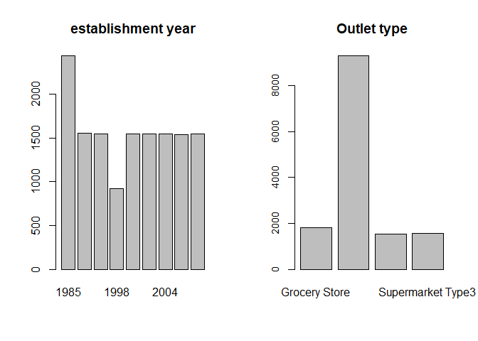
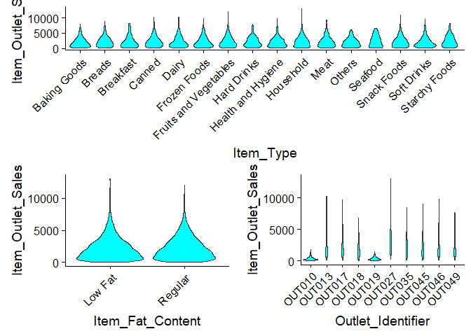
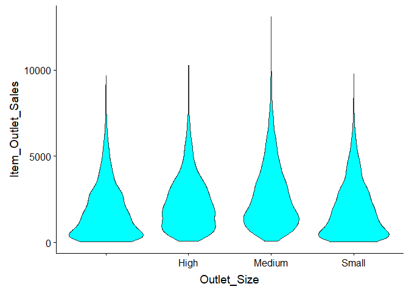
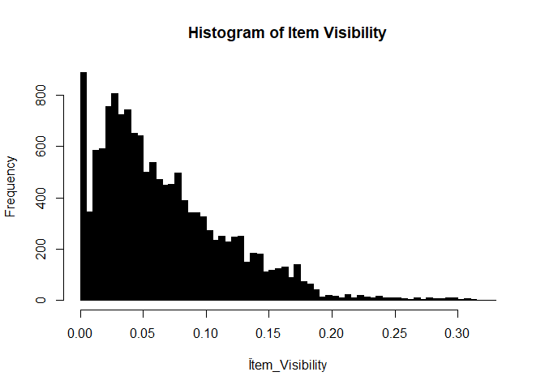
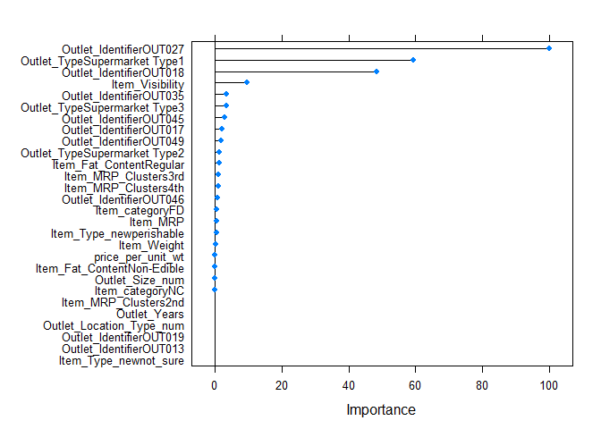
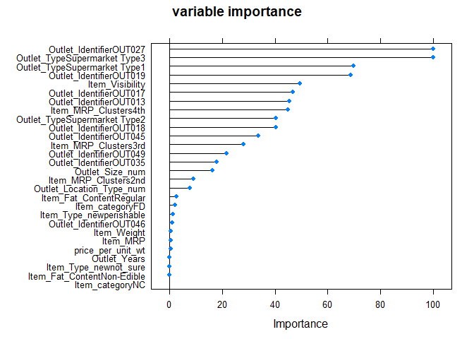

BIGMART SALES PROJECT
================

INTRODUCTION
============

Problem statement
-----------------

This projects is based on data collected by data scientists at BigMart for 1559 products acreoos 10 stores in different cities.Eche products has different variables that differenciates it from the rest of the projects.

The aim of this project is to build a **predictive model** to find out the properties of any store.This can play a key role in increasing the overal sales.

Hypothesis Generation.
----------------------

At this point i will atempt to present the kind of questions i should answer in this project.Products are spread across many stores which are located in diffent areas.One factor affecting a product sales in one area doest affect the product in another area.Customers also have different qualities that affect their purchasing activities.

I will divide the levels into different categories.

### Store Level hypotheses

1.  **City type**:Stores located in large cities are likely to have high sales levels because of the popilations desnsities there as compared to stores in smaller cities.

2.  **Population Density**:The higher the population density around a store the higher the sales expected from these areas.

3.  **Competitors**:Store having high number of competitors are likely to have lower lases margins.

4.  **Marketing**:Good marketing division in a store is likely to improve the sales volumes of a store.

5.  **Location**:Stores located in popular market are areas sre likely to have high sales.

6.  **Ambience**:Stores that are managed amd maintained well with proffesionals are likely to have high sales volumes.

### Product level Hypotheses

1.  **Brand**:Branded products are likey to have higher sales volumes as compared to unbranded products.

2.  **Packaging**:A well packaged product is likely to be bought by more customers as compared to a poorly packaged product.

3.  **Utility**:Products used daily are highly likely to be purchased.

4.  **Display area**:The better the display of a producti a supermarket the hirgher the posibility of being bought.

5.  **Adverstising.**:Products with better advertising are more likely to be purchased.Adverting plays a key role of reminding customers that a product's availability.

6.  **Visibility**:Products placed in an easily visible area in a mart will be purchased easily.

7.  **Promotional offers**:Customers are likely to purchase some products in promotional offers.

### Customer level

1.  **Customer Behaviour**:Store that keep the right type of product likely to meet the customer needs realize high sales.

2.  **Job Profile**:Customers with higher job profiles are more likely to purchase high amount of products.

3.  **Family Size**:The higher the size of the fammily will likely increase the amount of products purchased.

4.  **Annual Income**:Customers with higher annual income amount are more likely to purchase products as compared to those with lower income.

### Macro level

1.  **Environmet**:Customers are more likely to purchase from stores in friendly environments.This is a boost to stores located in friendly environments.

2.  **Economic Growth**:Stores located in areas with higher economic growth are expected to realize higher sales.

Well this gives a picture of what wil be going on below.I will try to look for paterns based on the above data.

Loading Data and R packages.
----------------------------

My project will be handled in R so it is important to load necesarry packages then the data.

### Packages.

``` r
packages = c("data.table","dplyr","ggplot2","caret","corrplot","xgboost","cowplot")
for (package in packages) {
  suppressPackageStartupMessages(require(package,character.only = TRUE))
}
```

The code chunk above will load my packages into R working session.

### The data

My data is divided ito train and test data sets.I will load these sets separately.

``` r
train = fread("C:/Users/RuralNet011/Documents/bigmart/Train.csv")
test = fread("C:/Users/RuralNet011/Documents/bigmart/Test.csv")
```

Data Properties
---------------

At this stage i will do some preliminary analysis in order to understand my data thoroughly.This will be in form of the dimensions,the variable names data types used in recording my data.

### Dimensions

``` r
dim(train)
```

    ## [1] 8523   12

``` r
dim(test)
```

    ## [1] 5681   11

The output from the chunk above tells me that the train dataset has 12 variables and 8523 observations and the test set has 11 variables and 5681 observations.

The extra variable in the train set might be the target variable to be predicted.

### Variables in the data.

``` r
names(train)
```

    ##  [1] "Item_Identifier"           "Item_Weight"              
    ##  [3] "Item_Fat_Content"          "Item_Visibility"          
    ##  [5] "Item_Type"                 "Item_MRP"                 
    ##  [7] "Outlet_Identifier"         "Outlet_Establishment_Year"
    ##  [9] "Outlet_Size"               "Outlet_Location_Type"     
    ## [11] "Outlet_Type"               "Item_Outlet_Sales"

``` r
names(test)
```

    ##  [1] "Item_Identifier"           "Item_Weight"              
    ##  [3] "Item_Fat_Content"          "Item_Visibility"          
    ##  [5] "Item_Type"                 "Item_MRP"                 
    ##  [7] "Outlet_Identifier"         "Outlet_Establishment_Year"
    ##  [9] "Outlet_Size"               "Outlet_Location_Type"     
    ## [11] "Outlet_Type"

Looking keenly I can see that "**Item\_Outlet\_Sales**" column is not pressent in the test set.This is therefore my target variable to be predicted.

### Data Structure

Data structure will enable me to know the format my data is stored in R.This is important because it will guide in deciding the analysis technique to be used at analysis stage.

``` r
glimpse(train)
```

    ## Observations: 8,523
    ## Variables: 12
    ## $ Item_Identifier           <chr> "FDA15", "DRC01", "FDN15", "FDX07", ...
    ## $ Item_Weight               <dbl> 9.300, 5.920, 17.500, 19.200, 8.930,...
    ## $ Item_Fat_Content          <chr> "Low Fat", "Regular", "Low Fat", "Re...
    ## $ Item_Visibility           <dbl> 0.016047301, 0.019278216, 0.01676007...
    ## $ Item_Type                 <chr> "Dairy", "Soft Drinks", "Meat", "Fru...
    ## $ Item_MRP                  <dbl> 249.8092, 48.2692, 141.6180, 182.095...
    ## $ Outlet_Identifier         <chr> "OUT049", "OUT018", "OUT049", "OUT01...
    ## $ Outlet_Establishment_Year <int> 1999, 2009, 1999, 1998, 1987, 2009, ...
    ## $ Outlet_Size               <chr> "Medium", "Medium", "Medium", "", "H...
    ## $ Outlet_Location_Type      <chr> "Tier 1", "Tier 3", "Tier 1", "Tier ...
    ## $ Outlet_Type               <chr> "Supermarket Type1", "Supermarket Ty...
    ## $ Item_Outlet_Sales         <dbl> 3735.1380, 443.4228, 2097.2700, 732....

``` r
glimpse(test)
```

    ## Observations: 5,681
    ## Variables: 11
    ## $ Item_Identifier           <chr> "FDW58", "FDW14", "NCN55", "FDQ58", ...
    ## $ Item_Weight               <dbl> 20.750, 8.300, 14.600, 7.315, NA, 9....
    ## $ Item_Fat_Content          <chr> "Low Fat", "reg", "Low Fat", "Low Fa...
    ## $ Item_Visibility           <dbl> 0.007564836, 0.038427677, 0.09957490...
    ## $ Item_Type                 <chr> "Snack Foods", "Dairy", "Others", "S...
    ## $ Item_MRP                  <dbl> 107.8622, 87.3198, 241.7538, 155.034...
    ## $ Outlet_Identifier         <chr> "OUT049", "OUT017", "OUT010", "OUT01...
    ## $ Outlet_Establishment_Year <int> 1999, 2007, 1998, 2007, 1985, 1997, ...
    ## $ Outlet_Size               <chr> "Medium", "", "", "", "Medium", "Sma...
    ## $ Outlet_Location_Type      <chr> "Tier 1", "Tier 2", "Tier 3", "Tier ...
    ## $ Outlet_Type               <chr> "Supermarket Type1", "Supermarket Ty...

Out put here gives a clear picture :4 numeric variables and 7 categorical variables.

### Combination of the train and the test data sets

In order to easen the next steps in my data analysis project i am going to combine my train and test sets of data into one set.

I will later split them.

``` r
test[,Item_Outlet_Sales := NA]
comb = rbind(train,test)
dim(comb)
```

    ## [1] 14204    12

EXPLORATORY DATA ANALYSIS
=========================

Univariate Analysis
-------------------

At this tage i will dive into my data to understand it more interms of distribution of variables,handle missing values and relationship with other variables.

In univariate analisis i will explore my variables one by one.

### Target Variable

The target variable for this data was measeured in a continuous scale so a histogram will work best for visualization.

``` r
train %>% ggplot(aes(train$Item_Outlet_Sales)) + geom_histogram(binwidth = 100,fill = "orange")+
  theme(plot.tag = element_text(hjust = .5))+
  labs(x = "Item_Outlet_Sales",title="Histogram of Item Outlet sales",caption = "Source:BigMart Data")
```


This histogram is plainly showing that our data is skewed to the right and data transormation will be neccesary to try and correct this problem.

### Independent Numeric Variables

``` r
plot1 = comb %>% ggplot(mapping = aes(Item_Weight))+geom_histogram(binwidth = .5,fill = "darkgreen")
plot2 = comb %>% 
  ggplot(mapping = aes(Item_Visibility))+
  geom_histogram(binwidth = .005,fill = "darkgreen")
plot3 = comb %>% ggplot(mapping = aes(Item_MRP))+geom_histogram(binwidth = 5,fill = "darkgreen")
plot_grid(plot1,plot2,plot3,nrow = 1)#required for arranging plots in a grid 
```

    ## Warning: Removed 2439 rows containing non-finite values (stat_bin).


**Inferences from the plots**

-   No clear patern from Item weight variable.

-   Item visobility is behaving like the target variable item outlet sales(right skewed) and should be transformed.

-   There are four different distributions for item MRP .

### Independent Categorical Variables

``` r
barplot(table(comb$Item_Fat_Content),xlab = "Item fat content",main = "Distribution of item fat content",col = "red")
```


From the figure i can see some disturbing levels ,"LF",'low fat' and 'Low fat'.These can be belonging to one category so i will combine them into one.The difference can be caused by lack of one data entry rule in different stores across the cities.A simillar case for 'reg' and 'Regular'.

Item fat content seems to have some unusual characteristics here so i will start with it.

I will generate tables for the variables first then visualize them in a chart.

``` r
table(comb$Item_Fat_Content)
```

    ## 
    ##      LF low fat Low Fat     reg Regular 
    ##     522     178    8485     195    4824

``` r
comb$Item_Fat_Content[comb$Item_Fat_Content == 'LF'] = 'Low Fat'
comb$Item_Fat_Content[comb$Item_Fat_Content == 'low fat'] = 'Low Fat'
comb$Item_Fat_Content[comb$Item_Fat_Content == 'reg'] = 'Regular'
#and now
table(comb$Item_Fat_Content)
```

    ## 
    ## Low Fat Regular 
    ##    9185    5019

``` r
barplot(table(comb$Item_Fat_Content),xlab = "Item fat content",main = "Distribution of item fat content",col = "coral1")
```


Other categorical variables.

``` r
#item type table
table(comb$Item_Type)
```

    ## 
    ##          Baking Goods                Breads             Breakfast 
    ##                  1086                   416                   186 
    ##                Canned                 Dairy          Frozen Foods 
    ##                  1084                  1136                  1426 
    ## Fruits and Vegetables           Hard Drinks    Health and Hygiene 
    ##                  2013                   362                   858 
    ##             Household                  Meat                Others 
    ##                  1548                   736                   280 
    ##               Seafood           Snack Foods           Soft Drinks 
    ##                    89                  1989                   726 
    ##         Starchy Foods 
    ##                   269

``` r
#item identifier table
# table(comb$Item_Identifier)
#outlet size table
table(comb$Outlet_Size)
```

    ## 
    ##          High Medium  Small 
    ##   4016   1553   4655   3980

``` r
#ITEM TYPE PLOT
plot4 = comb %>% select(Item_Type) %>% ggplot(aes(Item_Type))+geom_bar(fill = "cyan")+labs(x = "",title = "Item types")+theme(axis.text.x = element_text(angle = 45,hjust = 1))
#ITEM IDENTIFIER PLOT
plot5 = comb %>% select(Outlet_Identifier) %>% ggplot(aes(Outlet_Identifier))+geom_bar(fill = "cyan")+labs(x = "Outlet_Identifier")+theme(axis.text.x = element_text(angle = 45,hjust = 1))
#OUTLET SIZE PLOT

plot6 = comb %>% select(Outlet_Size) %>% ggplot(aes(Outlet_Size))+geom_bar(fill ="cyan")

#arranging the plots into a grid
plot4
```


``` r
plot_grid(plot5,plot6,nrow = 1)
```


4016 values are missing from outlet size data above.(evident from the *table*)

``` r
#ploting establishment year
(v = table(comb$Outlet_Establishment_Year))
```

    ## 
    ## 1985 1987 1997 1998 1999 2002 2004 2007 2009 
    ## 2439 1553 1550  925 1550 1548 1550 1543 1546

``` r
par(mfrow = c(1,2))
barplot(v,main = "establishment year")
(u = table(comb$Outlet_Type))
```

    ## 
    ##     Grocery Store Supermarket Type1 Supermarket Type2 Supermarket Type3 
    ##              1805              9294              1546              1559

``` r
barplot(u,main ='Outlet type',cex.axis = .9)
```



Not so much can be infered here but we can see Supermarket type 1 ia the most popuar with 9294.

Also outlets established in 1998 is least popular.

Bivariate Analysis
------------------

At this stage i will now look at the relationship between every explanatory variable the predictor variable.

My main aim is to discover any hidden relationship between the independent variable and the target variable.

Again i will have to extract my data back to train and test data because the test data ddoesnt have the predictor variable.

``` r
 #extracting train data from combined data
train = comb[1:nrow(train)]
```

### Target Variable VS Independent Numerical Variable.

1.  **NUMERICAL VARIABLES**

``` r
plot9 = ggplot(train)+
  geom_point(aes(Item_Weight,Item_Outlet_Sales),color = "cyan",alpha = .3)+
  theme(axis.title = element_text(size = 9.5))
plot10 = ggplot(train)+
  geom_point(aes(Item_Visibility,Item_Outlet_Sales),color = "cyan",alpha = .3)+
  theme(axis.title = element_text(size = 9.5))
plot11 = ggplot(train)+
  geom_point(aes(Item_MRP,Item_Outlet_Sales),color = "cyan",alpha = .3)+
  theme(axis.title = element_text(size = 9.5))

row2 = plot_grid(plot10,plot11,ncol = 2)
plot_grid(plot9,row2,nrow = 2)
```

    ## Warning: Removed 1463 rows containing missing values (geom_point).


**Observations from the above plots**

The following are some of the inferences I can make from the above plots.

1.  Item outlet sales is spread evenly acros the entire range of item weight without any patern.

2.  In item visibility vs item outlet sales ,there is a some an ussual occurence at item visibility 0.0.Item visibility cannot be entirely zero.

3.  Item MRP vs Outlet Sales column show four clear segments.

### Target variable vs independent categorical variable.

At this point i will investigate the distribution of the target variable across all categories of the categorical variables.

Box plots and violin plots are a good choice for this .I am going to make both.

``` r
plot12 = ggplot(train)+
  geom_violin(aes(Item_Type,Item_Outlet_Sales),fill = "cyan")+
  theme(axis.text.x  = element_text(angle = 45,hjust = 1))

plot13 = ggplot(train)+
  geom_violin(aes(Item_Fat_Content,Item_Outlet_Sales),fill = "cyan")+
  theme(axis.text.x  = element_text(angle = 45,hjust = 1))

plot14 = ggplot(train)+
  geom_violin(aes(Outlet_Identifier,Item_Outlet_Sales),fill = "cyan")+
  theme(axis.text.x  = element_text(angle = 45,hjust = 1))
rw2 = plot_grid(plot13,plot14,ncol = 2)
plot_grid(plot12,rw2,ncol = 1)
```



**Observations from the plots**

\*. Distribution looks similar across all item fat content

\*. Distribitions from outlet 19 and 10 lare different from their counterparts and similar too.

Earlier in univariate analysis there were empty values in the outlet size variables .

``` r
ggplot(train)+geom_violin(aes(Outlet_Size,Item_Outlet_Sales),fill = "cyan")
```



Something looks funnny here!Distribution for small size outlets is almost similar to te blank category.I am therefore going to substitute in the outlet size with small.

``` r
plot15 = ggplot(train,aes(Outlet_Location_Type,Item_Outlet_Sales))+geom_violin(fill = "orange")
plot16 = ggplot(train,aes(Outlet_Type,Item_Outlet_Sales))+geom_violin(fill = "blue")
plot_grid(plot15,plot16,ncol =1)
```


**Inferences from above**

-   Tier 1 and Tier 3 look a bit simmilar to one another.

-   Outlet Type plot ,grocery is deferent from the rest of the roups as most of its points are around the lower sales.

DATA PREPARATION
================

Missing Value Treatment
-----------------------

Missing values are a common occurence in real life data.It is for this reason that we should handle them in a friendly manner in order to get the most infrmation from our data.

There are somany ways to work with missing values in statistics.We build predictive modeling techniques to try and predict these missing value,imute the missing values with mean and median or even crudely delete the missing observation or variables with more mossing values.All these methods have their advantages and disadvantages.

Aquick check to se the prescence o these missing values:

``` r
table(is.na(comb))
```

    ## 
    ##  FALSE   TRUE 
    ## 162328   8120

``` r
table(is.na(comb$Item_Weight))
```

    ## 
    ## FALSE  TRUE 
    ## 11765  2439

I can see 8120 missing values in total and 2439 from item weight!

### Imputing Missing Values

So item weights seems to have the highest number of missing values.

``` r
missing_index = which(is.na(comb$Item_Weight))
for (i in missing_index) {
  item = comb$Item_Identifier[i]
  comb$Item_Weight[i] = mean(comb$Item_Weight[comb$Item_Identifier == item],na.rm = TRUE)
}

comb$Item_Weight[1]
```

    ## [1] 9.3

``` r
sum(is.na(comb$Item_Weight))
```

    ## [1] 0

### Replacing 0's in the visibility variable.

Earlie on we spotted an unusual behaviour in the visibility variable.There was a string of zeros but as said,visibility cannot just be zero.

``` r
hist(comb$Item_Visibility,breaks = 50.0,col = "black",main = "Histogram of Item Visibility",xlab = "Ïtem_Visibility")
```



FEATURE ENGINEERING
-------------------

The given variables will not be enough to help me build my model wel.I will now use what i have to try and generate some new features.

-   *ItemtypeNew*.Broader categories for the variable *Item\_type*.

-   *ItemCategory*.Categorical Variable derived from item identifier.

-   Outletyears. Years of operation for outlets

-   priceperunitwt: itemMRP/IteMweight

\*ItemMRPclusters:Binned feature fofr itemMRP

So here i am going to classify the categories into perishable and non perishable

``` r
perishable = c("Breads","Breakfast","Dairy","Fruits and Vegetables","Meats","Seafood")
non_perishable = c("Backing Goods","Canned","Frozen Foods","Hard Drinks","Health and Hygiene","Household","Soft Drinks")

comb[,Item_Type_new := ifelse(Item_Type%in%perishable,"perishable",ifelse(Item_Type %in% non_perishable,"non_perishable","not_sure"))]
```

I will now compare item type with the first two characters of item identifier.

``` r
table(comb$Item_Type,substr(comb$Item_Identifier,1,2))
```

    ##                        
    ##                           DR   FD   NC
    ##   Baking Goods             0 1086    0
    ##   Breads                   0  416    0
    ##   Breakfast                0  186    0
    ##   Canned                   0 1084    0
    ##   Dairy                  229  907    0
    ##   Frozen Foods             0 1426    0
    ##   Fruits and Vegetables    0 2013    0
    ##   Hard Drinks            362    0    0
    ##   Health and Hygiene       0    0  858
    ##   Household                0    0 1548
    ##   Meat                     0  736    0
    ##   Others                   0    0  280
    ##   Seafood                  0   89    0
    ##   Snack Foods              0 1989    0
    ##   Soft Drinks            726    0    0
    ##   Starchy Foods            0  269    0

From the above output,i can be able to create a new variable called Item Category.

``` r
comb = mutate(comb,Item_category = substr(comb$Item_Identifier,1,2))
```

Item fat content values will be changed whenever item category is NC since non consumables cannot have a fat content.

``` r
comb$Item_Fat_Content[comb$Item_category == "NC"] = "Non-Edible"

table(comb$Item_Fat_Content)
```

    ## 
    ##    Low Fat Non-Edible    Regular 
    ##       6499       2686       5019

It will also be important to categorise this data with years of operation.This will be calculated by subtracting the year of establishment and the current year the data was collected.

``` r
names(comb)
```

    ##  [1] "Item_Identifier"           "Item_Weight"              
    ##  [3] "Item_Fat_Content"          "Item_Visibility"          
    ##  [5] "Item_Type"                 "Item_MRP"                 
    ##  [7] "Outlet_Identifier"         "Outlet_Establishment_Year"
    ##  [9] "Outlet_Size"               "Outlet_Location_Type"     
    ## [11] "Outlet_Type"               "Item_Outlet_Sales"        
    ## [13] "Item_Type_new"             "Item_category"

``` r
comb = mutate(comb,Outlet_Years = 2013 - Outlet_Establishment_Year) 

comb = mutate(comb,Outlet_Establishment_Year = as.factor(comb$Outlet_Establishment_Year))

comb = comb %>% mutate(price_per_unit_wt = Item_MRP/Item_Weight)
```

Item-MRP was devided into four distinctive groups .I will assign a label to each group.This will lead us to a new variabe.

``` r
comb = comb %>% mutate(Item_MRP_Clusters = ifelse(Item_MRP < 69,"1st",ifelse(Item_MRP >=69 & Item_MRP < 136,"2nd",ifelse(Item_MRP > 136 &  Item_MRP < 203,"3rd","4th"))))
```

ENCODING CATEGORICAL VARIABLES
------------------------------

Since most ML algorithms produce better result with numerical variables ,i am gooing to convert them into numerical variables in order to work with them at a later time.

### Label Encoding for categorical variables

Label encoding means converting each category to a number.This opperation is suitable for ordinal variables.

``` r
comb = mutate(comb, Outlet_Size_num = ifelse(Outlet_Size == "Small",0,
                                             ifelse(Outlet_Size == "Medium",1,2)))
comb = mutate(comb, Outlet_Location_Type_num = ifelse(Outlet_Location_Type == "Tier 3",0,
                                             ifelse(Outlet_Location_Type == "Tier 2",1,2)))
names(comb)
```

    ##  [1] "Item_Identifier"           "Item_Weight"              
    ##  [3] "Item_Fat_Content"          "Item_Visibility"          
    ##  [5] "Item_Type"                 "Item_MRP"                 
    ##  [7] "Outlet_Identifier"         "Outlet_Establishment_Year"
    ##  [9] "Outlet_Size"               "Outlet_Location_Type"     
    ## [11] "Outlet_Type"               "Item_Outlet_Sales"        
    ## [13] "Item_Type_new"             "Item_category"            
    ## [15] "Outlet_Years"              "price_per_unit_wt"        
    ## [17] "Item_MRP_Clusters"         "Outlet_Size_num"          
    ## [19] "Outlet_Location_Type_num"

``` r
 comb = comb %>% select(-c("Outlet_Size","Outlet_Location_Type"))

names(comb)
```

    ##  [1] "Item_Identifier"           "Item_Weight"              
    ##  [3] "Item_Fat_Content"          "Item_Visibility"          
    ##  [5] "Item_Type"                 "Item_MRP"                 
    ##  [7] "Outlet_Identifier"         "Outlet_Establishment_Year"
    ##  [9] "Outlet_Type"               "Item_Outlet_Sales"        
    ## [11] "Item_Type_new"             "Item_category"            
    ## [13] "Outlet_Years"              "price_per_unit_wt"        
    ## [15] "Item_MRP_Clusters"         "Outlet_Size_num"          
    ## [17] "Outlet_Location_Type_num"

### One hot encoding for the categorical variable

One hot encoding is used to transform categorical variables into separate series of 0's and 1's.

``` r
dum = dummyVars(" ~ .",data = comb %>% select(-c("Item_Identifier","Outlet_Establishment_Year","Item_Type")),fullRank = T)

 ohe_df = data.table(predict(dum, comb %>% select(-c("Item_Identifier","Outlet_Establishment_Year","Item_Type"))))

comb = cbind(comb[,"Item_Identifier"], ohe_df)
```

Finally i will split the combined data again.Then remove item outlet sales for test data set.

``` r
train = comb[(1:nrow(train))]
test = comb[(nrow(train)+1):nrow(comb)]
test[,Item_Outlet_Sales := NULL]
```

PRE ROCESSING DATA
------------------

### Removing skew ness

It is a statistical common sense that skewed data is undesirable for analysis.

``` r
comb = comb %>% mutate(Item_Visibility = log(Item_Visibility+1))
comb = comb %>% mutate(price_per_unit_wt = log(price_per_unit_wt+1))
```

### Standardizing Numeric predictors

This entails scalling of numeric vars to have a mean of zero and an sd of 1 and a scalling of zero to one.

``` r
num_vars = which(sapply(comb,is.numeric))

num_vars_names = names(num_vars)
comb_numeric = comb[,setdiff(num_vars_names, "Item_Outlet_Sales")]
prep_num = preProcess(comb_numeric, method=c("center", "scale"))
comb_numeric_norm = predict(prep_num, comb_numeric)
```

### Bivariate Correlation

``` r
cor_train = cor(train[,-c("V1")])
corrplot(cor_train,
         method = "pie", 
         type = "lower",
         tl.cex = 0.9)
```


MODELLING
=========

Model Building
--------------

Model building is the process of creating a suitable parameter system for predicting the product sales.

There are so many modelling techniques in statistics and i will focus on a number of them below:

-   Linear Regression

-   Lasso Regression

-   Ridge Regression

-   Random Forest

-   Xgboost

### Evaluation metrics for regression.

Building a model is one step and assesing the goodness of the model is anither thing.

Once i have built my model,i will run checks to see how good my model is by performing the following tests.

-   *Mean Absolute Error*(MAE)

$$=\\frac{1}{n}\\sum\_{i=1}^n|y\_i-\\hat y\_i|$$

-   *Mean squared error*(MSE)

$$=\\frac{1}{n}\\sum\_{i=1}^n(y\_i-\\hat y\_i)^2$$

-   *Root Mean Squared Error*(RMSE)

$$=\\sqrt(\\frac{1}{n}\\sum\_{i=1}^n|y\_i-\\hat y\_i|)$$

LINEAR REGRESSION
-----------------

Linear regression is used to predict a quantitative dependent variable with a number of quatitative independent variables.Incase of only one independent variable then we call it simple linear regression and in case of more than one independent variable then it is refered to as multiple linear regression.

The question takes the form of:

*y*<sub>*i*</sub> = *β*<sub>0</sub> + *β*<sub>1</sub>*x*<sub>1*i*</sub> + ... + *β*<sub>*n*</sub>*x*<sub>*n**i*</sub>
 \#\#\# Assumptions

-   *Normality*:For fixed number of independent variables ,the dependent variable should be normaly distributed.

-   *Independence:*The predictor variableshould be independent of each other.

-   *Linearity*:The dependent variable should linearly related to the independent variables.

-   *Homoscedasticity:*The variance of the dependent variable should not vary with levels of independent variable.

Building the model.
-------------------

``` r
attach(train)
linear_reg_mod = lm(Item_Outlet_Sales ~ .,data = train[,-c("V1")])
```

Making predictions on the test Data
-----------------------------------

``` r
submission = fread("Submission.csv")

submission$Item_Outlet_Sales = predict(linear_reg_mod,test[,-c("V1")])
```

    ## Warning in predict.lm(linear_reg_mod, test[, -c("V1")]): prediction from a
    ## rank-deficient fit may be misleading

``` r
write.csv(submission,'Linear_Reg_Submit.csv',row.names = F)
```

K-Fold Cross Validation
-----------------------

Cross validation techniques tell us how our model will perform in real life.This type of modeling i have done in this example show only a tip of the ice berg.

Sow how is it done?

1.  Randomly split data into k number of folds

2.  For each k fold ,i will build a model on k-1 folds of the data set.Then test the model to check the effectivenss of the kth fold.

3.  Recodrd the arror in each k fold.

4.Repeat this untill each of the k folds has served the test set.

The average of the k recorded errors is what is called the **cross validation error** ad will serve as the performance metric for the model.

Regularised regression Model
----------------------------

### Lasso Regression

``` r
set.seed(1235)
control = trainControl(method = "cv",number = 5)
Grid = expand.grid(alpha = 1 ,lambda = seq(0.001,0.1,by = 0.0002))
lasso_linear_reg_mod = train(x = train[, -c("V1", "Item_Outlet_Sales")], y = train$Item_Outlet_Sales,
                       method='glmnet', trControl= control, tuneGrid = Grid)

submission$Item_Outlet_Sales = predict(lasso_linear_reg_mod,test[,-c("V1")])

write.csv(submission,'laso.csv',row.names = F)
```

### Variable Importance

``` r
plot(varImp(lasso_linear_reg_mod))
```



### Ridge regression

``` r
set.seed(1236)
my_control = trainControl(method="cv", number=5)
Grid = expand.grid(alpha = 0, lambda = seq(0.001,0.1,by = 0.0002))

ridge_linear_reg_mod = train(x = train[, -c("V1", "Item_Outlet_Sales")], y = train$Item_Outlet_Sales,
                       method='glmnet', trControl= my_control, tuneGrid = Grid)

submission$Item_Outlet_Sales = predict(ridge_linear_reg_mod,test[,-c("V1")])

write.csv(submission,'ridgereg.csv',row.names = F)
```

### Variable Importance

``` r
plot(varImp(ridge_linear_reg_mod),main = "variable importance")
```



### Random Forest

I will apply the laws of random forest with 400 trees to try and predict the sales of products.

``` r
set.seed(1237)
cont = trainControl(method = "cv",number = 5)
tgrid = expand.grid(
  .mtry = c(3:10),
  .splitrule = "variance",
  .min.node.size = c(10,15,20)
)
# rf_mod = train(x=train[,c("V1","Item_Outlet_Sales")],
#                y = train$Item_Outlet_Sales,
#                method = 'ranger',
#                trControl = cont,
#                 tudeGrid = tgrid,
#                num.trees = 400,
#                importance = "permutation")
```

### Variable Importance

``` r
# plot(varImp(rf_mod))
```

XGBOOST
-------

``` r
parlist = list(
  objective = 'reg:linear',
  eta = 0.01,
  gamma = 1,
  max_depth = 6,
  subsample = 0.8,
  colsample_bytree = .5
)
dtrain = xgb.DMatrix(data = as.matrix(train[,-c("V1","Item_Outlet_Sales")]),
                     label = train$Item_Outlet_Sales)
dtest = xgb.DMatrix(data = as.matrix(test[,-c("V1")]))
set.seed(112)
xgbcv = xgb.cv(params = parlist,
               data = dtrain,
               nrounds = 1000,
               nfold = 5,
               print_every_n = 10,
               early_stopping_rounds = 30,
               maximize = F)
```

    ## [1]  train-rmse:2746.210059+7.807395 test-rmse:2746.239063+30.449579 
    ## Multiple eval metrics are present. Will use test_rmse for early stopping.
    ## Will train until test_rmse hasn't improved in 30 rounds.
    ## 
    ## [11] train-rmse:2536.486670+6.958374 test-rmse:2537.945312+29.754008 
    ## [21] train-rmse:2348.022607+4.601380 test-rmse:2351.301563+30.835236 
    ## [31] train-rmse:2179.425439+4.935632 test-rmse:2184.136425+29.540988 
    ## [41] train-rmse:2028.186426+4.642317 test-rmse:2034.907691+28.914868 
    ## [51] train-rmse:1897.699219+3.914338 test-rmse:1907.025512+29.147314 
    ## [61] train-rmse:1780.618775+3.150158 test-rmse:1792.642237+29.126345 
    ## [71] train-rmse:1676.562232+1.809542 test-rmse:1691.464209+29.371427 
    ## [81] train-rmse:1585.425171+1.489386 test-rmse:1603.085425+29.725540 
    ## [91] train-rmse:1507.195068+1.486720 test-rmse:1527.995996+29.751105 
    ## [101]    train-rmse:1437.867749+1.351783 test-rmse:1461.700342+28.757206 
    ## [111]    train-rmse:1377.230786+1.664761 test-rmse:1404.255981+28.137546 
    ## [121]    train-rmse:1324.920849+1.935976 test-rmse:1355.066333+27.215440 
    ## [131]    train-rmse:1280.171655+2.179874 test-rmse:1313.551318+26.797993 
    ## [141]    train-rmse:1241.298779+2.367538 test-rmse:1277.769312+25.407780 
    ## [151]    train-rmse:1207.136450+2.190679 test-rmse:1247.251929+25.187837 
    ## [161]    train-rmse:1178.481568+2.534381 test-rmse:1221.837158+24.198475 
    ## [171]    train-rmse:1153.119995+2.737281 test-rmse:1199.980396+23.589957 
    ## [181]    train-rmse:1131.616821+2.974261 test-rmse:1181.470972+23.292940 
    ## [191]    train-rmse:1112.957690+2.545006 test-rmse:1166.441455+23.353243 
    ## [201]    train-rmse:1096.229883+2.671352 test-rmse:1153.140747+22.850245 
    ## [211]    train-rmse:1082.175757+3.191834 test-rmse:1142.318091+22.208484 
    ## [221]    train-rmse:1069.883936+3.345436 test-rmse:1133.124634+21.684269 
    ## [231]    train-rmse:1059.003149+3.214065 test-rmse:1125.639746+21.336262 
    ## [241]    train-rmse:1049.573682+3.422527 test-rmse:1119.256396+21.113220 
    ## [251]    train-rmse:1041.297070+3.683712 test-rmse:1114.051709+20.827832 
    ## [261]    train-rmse:1033.776416+3.778025 test-rmse:1109.614502+20.317818 
    ## [271]    train-rmse:1027.405310+4.055698 test-rmse:1105.974902+20.133372 
    ## [281]    train-rmse:1021.685535+3.879444 test-rmse:1102.982788+19.878617 
    ## [291]    train-rmse:1016.447205+3.867526 test-rmse:1100.538696+19.694514 
    ## [301]    train-rmse:1011.588013+4.050991 test-rmse:1098.576733+19.522936 
    ## [311]    train-rmse:1007.106580+4.076963 test-rmse:1096.886401+19.307883 
    ## [321]    train-rmse:1002.798840+4.052368 test-rmse:1095.727734+19.159387 
    ## [331]    train-rmse:998.918103+4.205784  test-rmse:1094.760596+19.096895 
    ## [341]    train-rmse:995.406763+4.161043  test-rmse:1093.871753+19.008478 
    ## [351]    train-rmse:991.931372+4.140706  test-rmse:1093.205151+18.920755 
    ## [361]    train-rmse:988.595178+4.254218  test-rmse:1092.628394+18.981142 
    ## [371]    train-rmse:985.394714+4.320754  test-rmse:1092.091016+18.843907 
    ## [381]    train-rmse:982.596033+4.318276  test-rmse:1091.832959+18.815908 
    ## [391]    train-rmse:979.738452+4.334905  test-rmse:1091.637402+18.867347 
    ## [401]    train-rmse:976.794470+4.321719  test-rmse:1091.363696+18.998360 
    ## [411]    train-rmse:974.070435+4.403547  test-rmse:1091.411255+19.055234 
    ## [421]    train-rmse:971.459766+4.466630  test-rmse:1091.324487+18.902147 
    ## [431]    train-rmse:969.158398+4.521744  test-rmse:1091.339795+18.825901 
    ## [441]    train-rmse:966.443616+4.624623  test-rmse:1091.257153+18.693642 
    ## [451]    train-rmse:963.862329+4.830096  test-rmse:1091.228857+18.654947 
    ## [461]    train-rmse:961.517871+4.809351  test-rmse:1091.221045+18.619288 
    ## [471]    train-rmse:959.203039+4.923998  test-rmse:1091.466748+18.612800 
    ## Stopping. Best iteration:
    ## [446]    train-rmse:965.103796+4.650717  test-rmse:1091.185742+18.663148

The output above gives the best validation score at 446 th iteration.

``` r
xgbmodel = xgb.train(data = dtrain,params = parlist,nrounds = 446)
```

### Variable Importance

``` r
varimp = xgb.importance(feature_names = setdiff(names(train),c("V1","Item_Outlet_Sales")),model = xgbmodel)
xgb.plot.importance(varimp,main = "XGboost var importance ")
```


Conclusion
==========

This project showed the importance of thorough feature ingenering before carying out a predictive analysis.Again Ridge regression proved to be the best in predictive analysis of this data set.

Still more can be done to improve the case.
