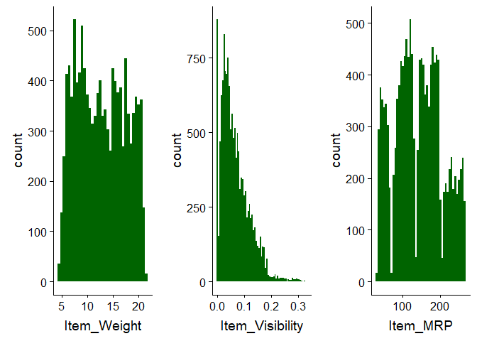
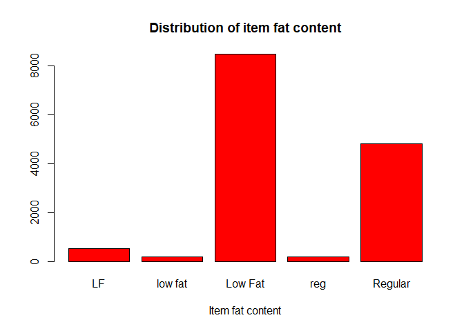
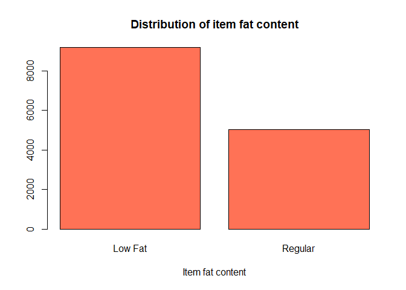
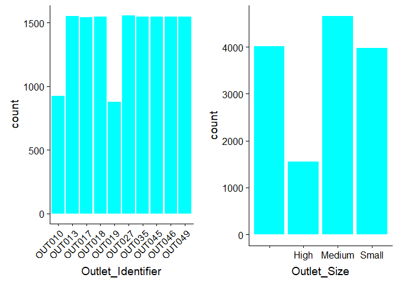

BIGMART SALES PROJECT
================

INTRODUCTION
============

Problem statement
-----------------

This projects is based on data collected by data scientists at BigMart for 1559 products acreoos 10 stores in different cities.Eche products has different variables that differenciates it from the rest of the projects.

The aim of this project is to build a **predictive model** to find out the properties of any store.This can play a key role in increasing the overal sales.

Hypothesis Generation.
----------------------

At this point i will atempt to present the kind of questions i should answer in this project.Products are spread across many stores which are located in diffent areas.One factor affecting a product sales in one area doest affect the product in another area.Customers also have different qualities that affect their purchasing activities.

I will divide the levels into different categories.

### Store Level hypotheses

1.  **City type**:Stores located in large cities are likely to have high sales levels because of the popilations desnsities there as compared to stores in smaller cities.

2.  **Population Density**:The higher the population density around a store the higher the sales expected from these areas.

3.  **Competitors**:Store having high number of competitors are likely to have lower lases margins.

4.  **Marketing**:Good marketing division in a store is likely to improve the sales volumes of a store.

5.  **Location**:Stores located in popular market are areas sre likely to have high sales.

6.  **Ambience**:Stores that are managed amd maintained well with proffesionals are likely to have high sales volumes.

### Product level Hypotheses

1.  **Brand**:Branded products are likey to have higher sales volumes as compared to unbranded products.

2.  **Packaging**:A well packaged product is likely to be bought by more customers as compared to a poorly packaged product.

3.  **Utility**:Products used daily are highly likely to be purchased.

4.  **Display area**:The better the display of a producti a supermarket the hirgher the posibility of being bought.

5.  **Adverstising.**:Products with better advertising are more likely to be purchased.Adverting plays a key role of reminding customers that a product's availability.

6.  **Visibility**:Products placed in an easily visible area in a mart will be purchased easily.

7.  **Promotional offers**:Customers are likely to purchase some products in promotional offers.

### Customer level

1.  **Customer Behaviour**:Store that keep the right type of product likely to meet the customer needs realize high sales.

2.  **Job Profile**:Customers with higher job profiles are more likely to purchase high amount of products.

3.  **Family Size**:The higher the size of the fammily will likely increase the amount of products purchased.

4.  **Annual Income**:Customers with higher annual income amount are more likely to purchase products as compared to those with lower income.

### Macro level

1.  **Environmet**:Customers are more likely to purchase from stores in friendly environments.This is a boost to stores located in friendly environments.

2.  **Economic Growth**:Stores located in areas with higher economic growth are expected to realize higher sales.

Well this gives a picture of what wil be going on below.I will try to look for paterns based on the above data.

Loading Data and R packages.
----------------------------

My project will be handled in R so it is important to load necesarry packages then the data.

### Packages.

``` r
packages = c("data.table","dplyr","ggplot2","caret","corrplot","xgboost","cowplot")
for (package in packages) {
  suppressPackageStartupMessages(require(package,character.only = TRUE))
}
```

The code chunk above will load my packages into R working session.

### The data

My data is divided ito train and test data sets.I will load these sets separately.

``` r
train = fread("C:/Users/RuralNet011/Documents/bigmart/Train.csv")
test = fread("C:/Users/RuralNet011/Documents/bigmart/Test.csv")
```

Data Properties
---------------

At this stage i will do some preliminary analysis in order to understand my data thoroughly.This will be in form of the dimensions,the variable names data types used in recording my data.

### Dimensions

``` r
dim(train)
```

    ## [1] 8523   12

``` r
dim(test)
```

    ## [1] 5681   11

The output from the chunk above tells me that the train dataset has 12 variables and 8523 observations and the test set has 11 variables and 5681 observations.

The extra variable in the train set might be the target variable to be predicted.

### Variables in the data.

``` r
names(train)
```

    ##  [1] "Item_Identifier"           "Item_Weight"              
    ##  [3] "Item_Fat_Content"          "Item_Visibility"          
    ##  [5] "Item_Type"                 "Item_MRP"                 
    ##  [7] "Outlet_Identifier"         "Outlet_Establishment_Year"
    ##  [9] "Outlet_Size"               "Outlet_Location_Type"     
    ## [11] "Outlet_Type"               "Item_Outlet_Sales"

``` r
names(test)
```

    ##  [1] "Item_Identifier"           "Item_Weight"              
    ##  [3] "Item_Fat_Content"          "Item_Visibility"          
    ##  [5] "Item_Type"                 "Item_MRP"                 
    ##  [7] "Outlet_Identifier"         "Outlet_Establishment_Year"
    ##  [9] "Outlet_Size"               "Outlet_Location_Type"     
    ## [11] "Outlet_Type"

Looking keenly I can see that "**Item\_Outlet\_Sales**" column is not pressent in the test set.This is therefore my target variable to be predicted.

### Data Structure

Data structure will enable me to know the format my data is stored in R.This is important because it will guide in deciding the analysis technique to be used at analysis stage.

``` r
glimpse(train)
```

    ## Observations: 8,523
    ## Variables: 12
    ## $ Item_Identifier           <chr> "FDA15", "DRC01", "FDN15", "FDX07", ...
    ## $ Item_Weight               <dbl> 9.300, 5.920, 17.500, 19.200, 8.930,...
    ## $ Item_Fat_Content          <chr> "Low Fat", "Regular", "Low Fat", "Re...
    ## $ Item_Visibility           <dbl> 0.016047301, 0.019278216, 0.01676007...
    ## $ Item_Type                 <chr> "Dairy", "Soft Drinks", "Meat", "Fru...
    ## $ Item_MRP                  <dbl> 249.8092, 48.2692, 141.6180, 182.095...
    ## $ Outlet_Identifier         <chr> "OUT049", "OUT018", "OUT049", "OUT01...
    ## $ Outlet_Establishment_Year <int> 1999, 2009, 1999, 1998, 1987, 2009, ...
    ## $ Outlet_Size               <chr> "Medium", "Medium", "Medium", "", "H...
    ## $ Outlet_Location_Type      <chr> "Tier 1", "Tier 3", "Tier 1", "Tier ...
    ## $ Outlet_Type               <chr> "Supermarket Type1", "Supermarket Ty...
    ## $ Item_Outlet_Sales         <dbl> 3735.1380, 443.4228, 2097.2700, 732....

``` r
glimpse(test)
```

    ## Observations: 5,681
    ## Variables: 11
    ## $ Item_Identifier           <chr> "FDW58", "FDW14", "NCN55", "FDQ58", ...
    ## $ Item_Weight               <dbl> 20.750, 8.300, 14.600, 7.315, NA, 9....
    ## $ Item_Fat_Content          <chr> "Low Fat", "reg", "Low Fat", "Low Fa...
    ## $ Item_Visibility           <dbl> 0.007564836, 0.038427677, 0.09957490...
    ## $ Item_Type                 <chr> "Snack Foods", "Dairy", "Others", "S...
    ## $ Item_MRP                  <dbl> 107.8622, 87.3198, 241.7538, 155.034...
    ## $ Outlet_Identifier         <chr> "OUT049", "OUT017", "OUT010", "OUT01...
    ## $ Outlet_Establishment_Year <int> 1999, 2007, 1998, 2007, 1985, 1997, ...
    ## $ Outlet_Size               <chr> "Medium", "", "", "", "Medium", "Sma...
    ## $ Outlet_Location_Type      <chr> "Tier 1", "Tier 2", "Tier 3", "Tier ...
    ## $ Outlet_Type               <chr> "Supermarket Type1", "Supermarket Ty...

Out put here gives a clear picture :4 numeric variables and 7 categorical variables.

### Combination of the train and the test data sets

In order to easen the next steps in my data analysis project i am going to combine my train and test sets of data into one set.

I will later split them.

``` r
test[,Item_Outlet_Sales := NA]
comb = rbind(train,test)
dim(comb)
```

    ## [1] 14204    12

EXPLORATORY DATA ANALYSIS
=========================

Univariate Analysis
-------------------

At this tage i will dive into my data to understand it more interms of distribution of variables,handle missing values and relationship with other variables.

In univariate analisis i will explore my variables one by one.

### Target Variable

The target variable for this data was measeured in a continuous scale so a histogram will work best for visualization.

``` r
train %>% ggplot(aes(train$Item_Outlet_Sales)) + geom_histogram(binwidth = 100,fill = "orange")+
  theme(plot.tag = element_text(hjust = .5))+
  labs(x = "Item_Outlet_Sales",title="Histogram of Item Outlet sales",caption = "Source:BigMart Data")
```


This histogram is plainly showing that our data is skewed to the right and data transormation will be neccesary to try and correct this problem.

### Independent Numeric Variables

``` r
plot1 = comb %>% ggplot(mapping = aes(Item_Weight))+geom_histogram(binwidth = .5,fill = "darkgreen")
plot2 = comb %>% 
  ggplot(mapping = aes(Item_Visibility))+
  geom_histogram(binwidth = .005,fill = "darkgreen")
plot3 = comb %>% ggplot(mapping = aes(Item_MRP))+geom_histogram(binwidth = 5,fill = "darkgreen")
plot_grid(plot1,plot2,plot3,nrow = 1)#required for arranging plots in a grid 
```

    ## Warning: Removed 2439 rows containing non-finite values (stat_bin).



**Inferences from the plots**

-   No clear patern from Item weight variable.

-   Item visobility is behaving like the target variable item outlet sales(right skewed) and should be transformed.

-   There are four different distributions for item MRP .

### Independent Categorical Variables

``` r
barplot(table(comb$Item_Fat_Content),xlab = "Item fat content",main = "Distribution of item fat content",col = "red")
```



From the figure i can see some disturbing levels ,"LF",'low fat' and 'Low fat'.These can be belonging to one category so i will combine them into one.The difference can be caused by lack of one data entry rule in different stores across the cities.A simillar case for 'reg' and 'Regular'.

Item fat content seems to have some unusual characteristics here so i will start with it.

I will generate tables for the variables first then visualize them in a chart.

``` r
table(comb$Item_Fat_Content)
```

    ## 
    ##      LF low fat Low Fat     reg Regular 
    ##     522     178    8485     195    4824

``` r
comb$Item_Fat_Content[comb$Item_Fat_Content == 'LF'] = 'Low Fat'
comb$Item_Fat_Content[comb$Item_Fat_Content == 'low fat'] = 'Low Fat'
comb$Item_Fat_Content[comb$Item_Fat_Content == 'reg'] = 'Regular'
#and now
table(comb$Item_Fat_Content)
```

    ## 
    ## Low Fat Regular 
    ##    9185    5019

``` r
barplot(table(comb$Item_Fat_Content),xlab = "Item fat content",main = "Distribution of item fat content",col = "coral1")
```



Other categorical variables.

``` r
#item type table
table(comb$Item_Type)
```

    ## 
    ##          Baking Goods                Breads             Breakfast 
    ##                  1086                   416                   186 
    ##                Canned                 Dairy          Frozen Foods 
    ##                  1084                  1136                  1426 
    ## Fruits and Vegetables           Hard Drinks    Health and Hygiene 
    ##                  2013                   362                   858 
    ##             Household                  Meat                Others 
    ##                  1548                   736                   280 
    ##               Seafood           Snack Foods           Soft Drinks 
    ##                    89                  1989                   726 
    ##         Starchy Foods 
    ##                   269

``` r
#item identifier table
# table(comb$Item_Identifier)
#outlet size table
table(comb$Outlet_Size)
```

    ## 
    ##          High Medium  Small 
    ##   4016   1553   4655   3980

``` r
#ITEM TYPE PLOT
plot4 = comb %>% select(Item_Type) %>% ggplot(aes(Item_Type))+geom_bar(fill = "cyan")+labs(x = "",title = "Item types")+theme(axis.text.x = element_text(angle = 45,hjust = 1))
#ITEM IDENTIFIER PLOT
plot5 = comb %>% select(Outlet_Identifier) %>% ggplot(aes(Outlet_Identifier))+geom_bar(fill = "cyan")+labs(x = "Outlet_Identifier")+theme(axis.text.x = element_text(angle = 45,hjust = 1))
#OUTLET SIZE PLOT

plot6 = comb %>% select(Outlet_Size) %>% ggplot(aes(Outlet_Size))+geom_bar(fill ="cyan")

#arranging the plots into a grid
plot4
```


``` r
plot_grid(plot5,plot6,nrow = 1)
```



4016 values are missing from outlet size data above.(evident from the *table*)

``` r
#ploting establishment year
(v = table(comb$Outlet_Establishment_Year))
```

    ## 
    ## 1985 1987 1997 1998 1999 2002 2004 2007 2009 
    ## 2439 1553 1550  925 1550 1548 1550 1543 1546

``` r
par(mfrow = c(1,2))
barplot(v,main = "establishment year")
(u = table(comb$Outlet_Type))
```

    ## 
    ##     Grocery Store Supermarket Type1 Supermarket Type2 Supermarket Type3 
    ##              1805              9294              1546              1559

``` r
barplot(u,main ='Outlet type',cex.axis = .9)
```


Not so much can be infered here but we can see Supermarket type 1 ia the most popuar with 9294.

Also outlets established in 1998 is least popular.

To be continued...
